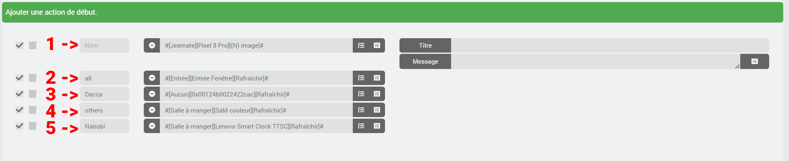
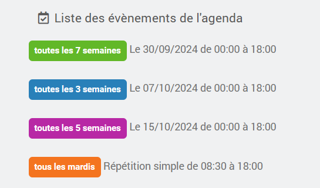
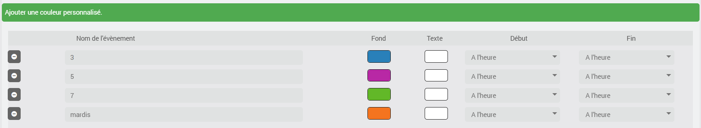
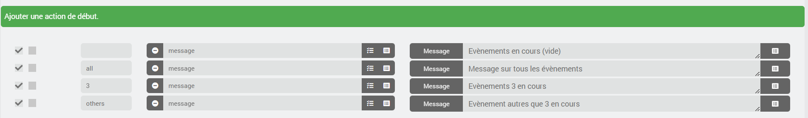
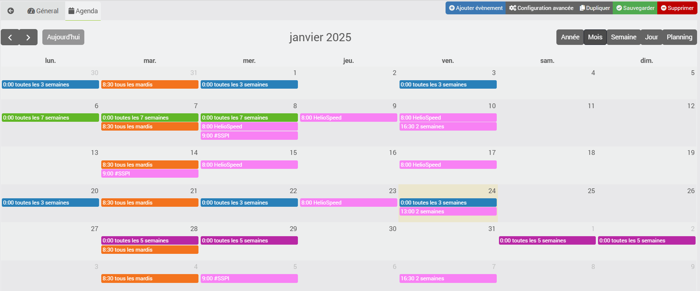

# Plugin import2calendar

Le plugin sert à importer un calendrier au format Ical dans le plugin Agenda officiel Jeedom (calendar).

**Attention : aucune modification du ical n'est possible, on récupère les infos du ical pour les envoyer au plugin Agenda de Jeedom. Ne faites aucune modification sur l'agenda créé dans le plugin Agenda, elles seraient supprimées au prochain update de votre ical.**

La configuration de celui-ci est très simple.

# Créer un équipement
Commencer par ajouter un équipement et choisir son nom
### Paramètre d'import
- **ical** : indiquer l'URL du fichier ical à convertir.
- **heure de début forcée** : choisir une heure de début d'évènement pour tous ceux du calendrier. Par défaut, ce seront les heures de début de l'évènement enregistré dans l'ical.
- **heure de fin forcée** : choisir une heure de fin d'évènement pour tous ceux du calendrier. Par défaut, ce seront les heures de fin de l'évènement enregistré dans l'ical.
- **ical auto** : vacances Françaises et jours fériés. Si sélectionné alors ne rien indiquer dans la zone ical.
- **cron** : choisir le temps de rafraîchissement voulu pour le calendrier.

### Paramètres d'affichage
- **icône** : l'icône qui sera appliquée à chaque event.
- **couleur de fond** : couleur de fond par défaut pour chaque event.
- **couleur de texte** : couleur de texte par défaut pour chaque event.

### Personnalisation des évènements
Ici vous pouvez choisir de personnaliser certains évènements de votre ical.

- Couleur du fond et couleur du texte.

Ici par défaut, rien n'est modifié, ces options permettent de modifier l'heure de début et de fin pour par exemple, anticiper les actions programmées.
- Heure de début : l'évènement verra son heure de début commencer X h avant.
- Heure de fin : l'évènement verra son heure de fin finir X h après.

### Actions de début et de fin
Pour tous les évènements de votre calendrier seront ajoutées les actions définies ici.
Vous pouvez réorganiser les actions en glisser/déposer.

Vous pouvez indiquer dans la case **nom**, l'évènement pour lequel l'action est prévue. 
- Accepte un nom partiel
- Ne tient pas compte des majuscules

**1** et **2** - Laisser vide ou mettre **all** pour que l'action soit ajoutée à tous les évènement de l'agenda.
**4** - Mettre **others** pour que l'action soit ajoutée à tous les évènement de l'agenda sauf ceux pour lesquels une action personnalisée est prévue.
**3** et **5** - Mettre le **nom de l'évènement** pour que l'action ne soit ajoutée que pour eux.

Vous pouvez maintenant cliquer sur **sauvegarder**.
L'agenda correspondant sera créé dans le plugin agenda.

Exemple :

Ici, nous voyons les évènement dans le plugin Agenda, on voit par ailleurs que j’ai personnalisé la couleur également.

La configuration dans le plugin import2calendar

On retourne sur l'agenda pour vérifier les actions

# Édition d'un équipement
Si vous modifiez une des options suivantes :
- icône
- couleur de fond
- couleur de texte
- actions de début
- actions de fin

Les events seront modifiés dans l'agenda (calendar)

# Gestion des évènements
A chaque sauvegarde ou à chaque fois que le cron défini parse l'ical alors si un évènement n'est plus dans l'ical, il est supprimé de l'agenda.
Les évènements passés de plus de 3 jours ne sont pas importés et seront supprimés au fur et à mesure.

# Occurrences
Les règles définies dans votre ical sont converties au format Jeedom Agenda. Je n'ai pas testé toutes les possibilités : si jamais certaines ne passent pas, merci de joindre la ligne du log import2calendar : **event options** (mettre vos logs en warning ou debug).

Les évènements présents dans l'occurrence restent visibles sur le calendrier tant que l'occurrence est valide.

Exemple : 1 évènement tous les 5 jours du 01-03-2024 au 24-11-2024. Tous les évènements sont visibles sur le calendrier jusqu'au 27-11-2024 (3 jours après la fin de l'occurrence).

## Plugin Agenda
Dans votre agenda, les commandes infos sur les événements à venir seront ajoutées.
Vous aurez donc 9 nouvelles commandes :
- hier
- aujourd'hui
- demain
- après demain
- j+3
- j+4
- j+5
- j+6
- j+7

## ical <-> jeedom
Pour certaines occurrences, il ne sera pas possible de convertir au format Jeedom, il faut donc adapter vos calendriers.
C'est le cas par exemple sur ceci :
- mardi et mercredi toutes les 3 semaines
Pour que cela soit remonté dans Jeedom, il vous faut créer :
- mardi toutes les 3 semaines
- mercredi toutes les 3 semaines

# JeeMate
- la description et le lieu seront visibles dans l'agenda importé dans JeeMate.

# Attention
- le nom de l'agenda créé est le même que celui de l'équipement + "-ical"
- la pièce sera identique

# Support
- Community Jeedom
- Discord JeeMate

# Demande d'aide
Afin de me simplifier la tâche lors du débug d'une erreur de conversion, je vous demanderai de créer un agenda de test avec seulement l'évènement qui pose problème et de me donner un accès à cet ICAL.

# Remerciemment
Le plugin et le support sont gratuits, vous souhaitez néanmoins m'offrir un café ou des couches pour bébé, je vous remercie par avance.

