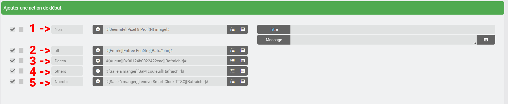
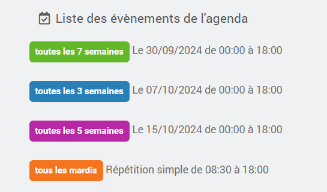
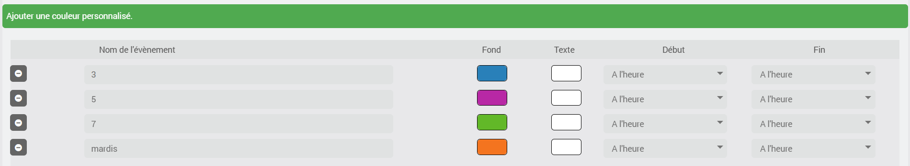
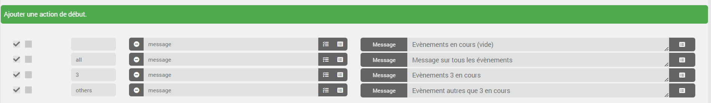
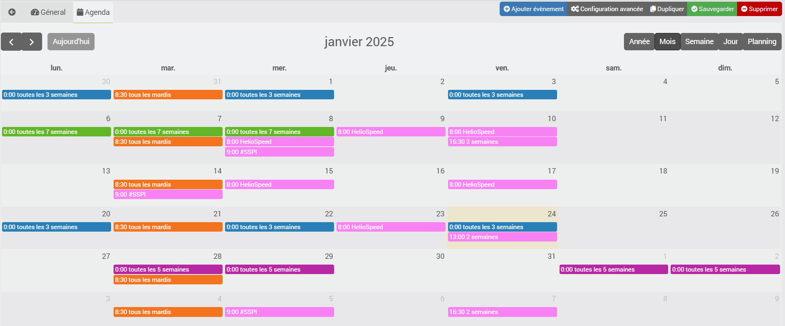

# Plugin import2calendar

O plugin serve para importar um calendário no formato iCal para o plugin Agenda oficial do Jeedom (calendar), pelo que este último deve estar instalado e configurado.
## Requisitos prévios
- Plugin Agenda
- Plugin import2calendar

## Atenção
**Não é possível efetuar quaisquer alterações no ficheiro iCal; as informações são recolhidas do ficheiro iCal para serem enviadas para o plugin Agenda do Jeedom. Não efetue quaisquer alterações na agenda criada no plugin Agenda, pois estas serão eliminadas na próxima atualização do seu ficheiro iCal.**

# <u>Configuração</u>

## Criar um equipamento
Comece por adicionar um dispositivo e escolha o seu nome
### Parâmetro de importação
- **ical**: indicar o URL do ficheiro ical a converter.
- **hora de início forçada**: selecionar uma hora de início para todos os eventos do calendário. Por predefinição, serão utilizadas as horas de início do evento registadas no iCal.
- **hora de fim obrigatória**: selecionar uma hora de fim para todos os eventos do calendário. Por predefinição, serão as horas de fim do evento registadas no iCal.
- **ical auto**: feriados franceses e dias festivos. Se esta opção for selecionada, não indique nada no campo ical.
- **cron**: selecionar o intervalo de atualização pretendido para o calendário.

### Parâmetros de visualização
- **ícone**: o ícone que será aplicado a cada evento.
- **cor de fundo**: cor de fundo predefinida para cada evento.
- **cor do texto**: cor do texto predefinida para cada evento.

### Personalização de eventos
Aqui pode optar por personalizar determinados eventos do seu ical.

- Cor do fundo e cor do texto.

Por predefinição, nada é alterado; estas opções permitem alterar a hora de início e de fim para, por exemplo, antecipar as ações programadas.
- Hora de início: o evento terá o seu início X horas antes.
- Hora de término: o evento terminará X horas depois.

### Ações de início e de fim
A todas as ocasiões do seu calendário serão adicionadas as ações aqui definidas.
Pode reorganizar as ações arrastando e largando.

Pode indicar na caixa **nome** o evento para o qual a ação está prevista.
- Aceita um nome parcial
- Não tem em conta as maiúsculas

**1** e **2** - Deixe em branco ou insira **all** para que a ação seja adicionada a todos os eventos da agenda.
**4** - Selecione **outros** para que a ação seja adicionada a todos os eventos da agenda, exceto aqueles para os quais está prevista uma ação personalizada.
**3** e **5** - Indique o **nome do evento** para que a ação seja adicionada apenas para esses eventos.

Agora pode clicar em **guardar**.
A agenda correspondente será criada no plugin de agenda.

Exemplo:

Aqui, vemos os eventos no plugin Agenda; além disso, podemos ver que também personalizei a cor.

A configuração no plugin import2calendar

Voltemos à agenda para verificar as ações

## Edição de um equipamento
Se alterar uma das seguintes opções:
- ícone
- cor de fundo
- cor do texto
- ações iniciais
- ações finais

Os eventos serão alterados no calendário

## Gestão de eventos
A cada cópia de segurança ou sempre que o cron definido analisa o ficheiro iCal, se um evento já não constar do iCal, é eliminado da agenda.
Os eventos passados com mais de 3 dias não são importados e serão eliminados à medida que forem surgindo.

## Ocorrências
As regras definidas no seu ical são convertidas para o formato do Jeedom Agenda. Ainda não testei todas as possibilidades; caso algumas não funcionem, por favor, anexe a linha do registo do import2calendar: **event options** (configure os seus registos para «warning» ou «debug»).

Os eventos presentes na ocorrência permanecem visíveis no calendário enquanto a ocorrência for válida.

Exemplo: 1 evento a cada 5 dias, de 01-03-2024 a 24-11-2024. Todos os eventos ficam visíveis no calendário até 27-11-2024 (3 dias após o fim da ocorrência).

## Plugin Agenda
Na sua agenda, serão adicionadas informações sobre os próximos eventos.
Terá, portanto, 9 novos comandos:
- ontem
- hoje
- amanhã
- depois de amanhã
- j+3
- dia 4
- j+5
- dia 6
- j+7

## ical <-> Jeedom
Em alguns casos, não será possível converter para o formato Jeedom, pelo que terá de adaptar os seus calendários.
É o caso, por exemplo, disto aqui:
- terça e quarta-feira, a cada três semanas
Para que esta informação seja transmitida ao Jeedom, é necessário criar:
- terça-feira, a cada 3 semanas
- quarta-feira, a cada 3 semanas

# <u>JeeMate</u>
- a descrição e o local ficarão visíveis na agenda importada para o JeeMate.

# <u>Atenção</u>
- o nome da agenda criada é igual ao do equipamento + «-ical» (agora já é possível alterá-lo)
- a divisão será idêntica

# <u>Suporte</u>
- Comunidade Jeedom
- Discord JeeMate

# <u>Pedido de ajuda</u>
Para facilitar o meu trabalho na depuração de um erro de conversão, peço-vos que criem um calendário de teste com apenas o evento que está a causar problemas e que me concedam acesso a esse ficheiro iCal.

# <u>Agradecimentos</u>
O plugin e o suporte são gratuitos; no entanto, se quiserem oferecer-me um café ou fraldas para bebé, agradeço desde já.

